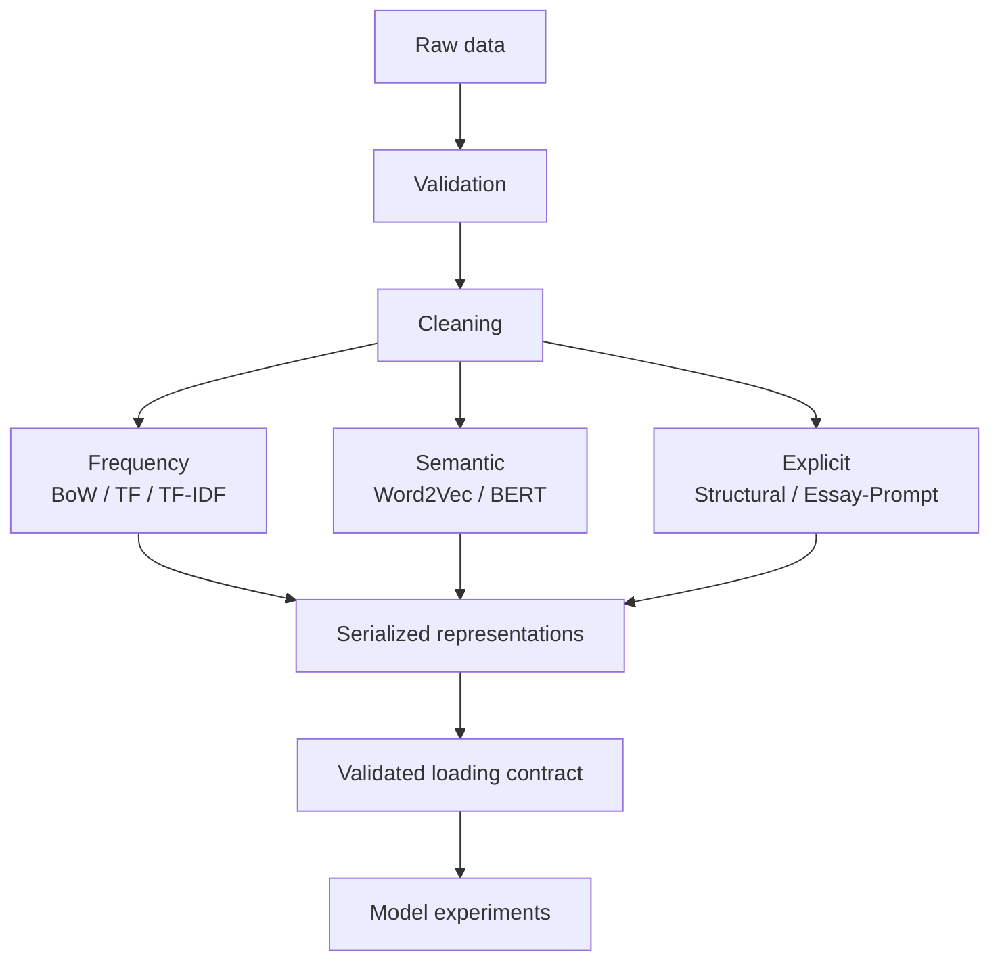

# Representation pipeline architecture

Validation owns input schemas, split boundaries, target checks, and dataset hashes. Cleaning owns canonical `essay_clean` text and cleaning metadata. Representation builders fit only on training text when fitting is required; they remain independent of target values.

Each run contains cleaned split CSVs, representation directories, split-ID alignment records, reports, and one manifest. The manifest indexes every representation, its family, native sparse/dense storage, shape, dtype, feature dimension, configuration, artifacts, and provenance.

The loading contract is the model boundary. It validates all split rows, shared feature dimensions, metadata, artifact hashes when present, and exact ID order before returning native matrices plus independent target arrays. Model code therefore does not know how cleaning, tokenization, fitting, pooling, or serialization works.
