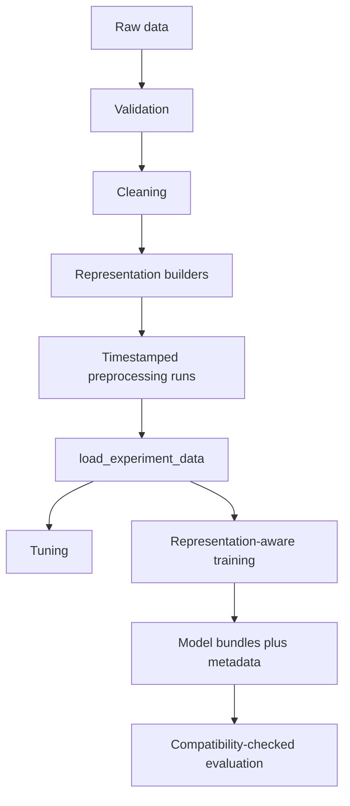

# Architecture

Validation owns input schemas, split boundaries, target checks, and input hashes. Cleaning owns canonical `essay_clean` text and cleaning metadata. Representation builders fit only on training text when fitting is required and write native sparse/dense artifacts plus a manifest under one timestamped run.

The loader is the model boundary. It validates representation declarations, shapes, dtypes, artifact hashes, split IDs, and target alignment before returning native matrices and independent target mappings. Model code therefore does not know how cleaning, tokenization, fitting, pooling, or serialization works.

Training writes `artifacts/models/<representation>/<model>/` with one target model per file and `metadata.json` containing the source run name, representation, model, parameters, and targets. Evaluation validates that metadata against the requested preprocessing run before prediction. This prevents a model trained on one representation from being silently reused for another.

Run discovery is centralized in `src.models.data`: `latest` for training/evaluation selects the newest run containing the requested representation, while tuning applies the same lookup independently for each candidate. All serialized paths required for reload are relative to their artifact/run directory.
